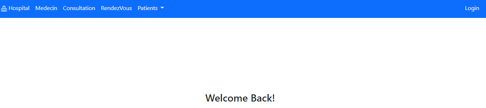
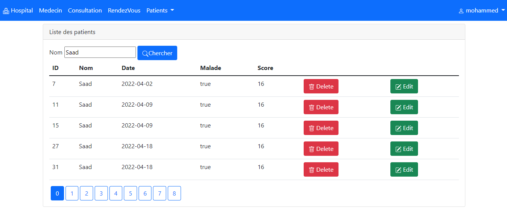
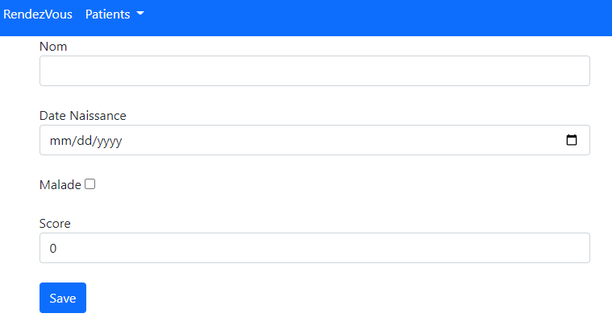
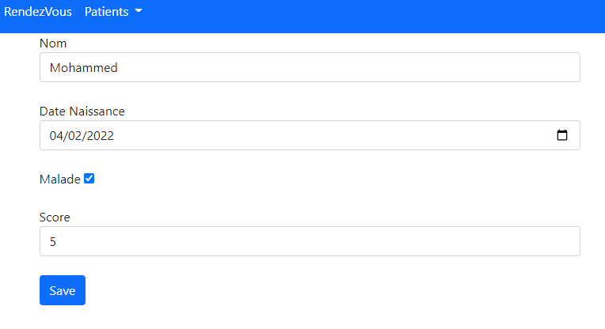
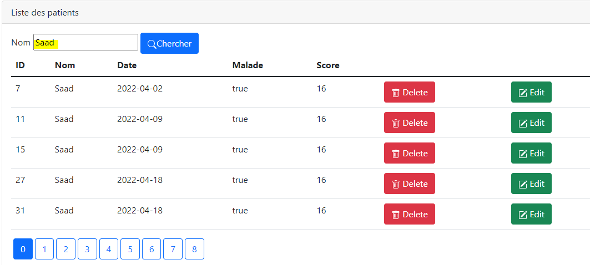

<h3>Introduction</h3>

Sécuriser L'accès à l'application qui permet de gérer les Patients en utilisant Spring Security

<h5>Objectif:</h5>

L'accès à l'application doit nécessite une Authentification avec username et un mot de passe.

Un utilisateur peut avoir plusieurs roles :

- ROLE_USER: permettant de chercher des patients

- ROLE_ADMIN: permettant d'ajouter, Mettre à jour et supprimer les patients

<h5>Architecure:</h5>

 

<h5>Interface:</h5>

Page home

Page index

Formulaire d'ajout

Formulaire pour éditer

Formulaire Login

Rechercher un patient

