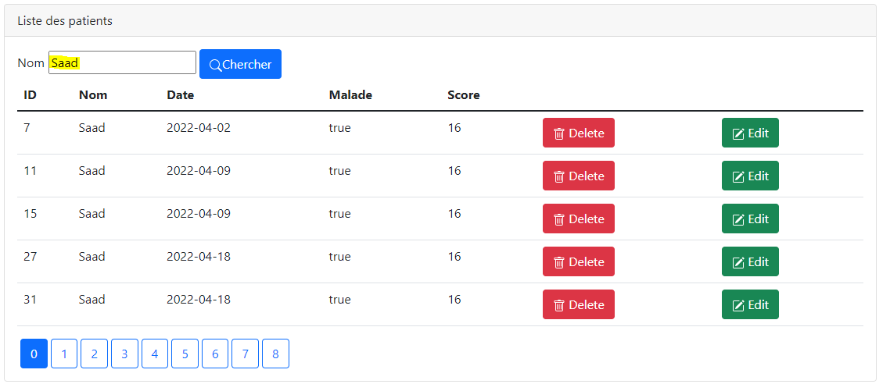

<h3>Introduction</h3>

Sécuriser L'accès à l'application qui permet de gérer les Patients en utilisant Spring Security

Trois Stratégies utilisées:

<ul>
 <li> InMemoryAuthentication</li>
 <li> JDBCAuthentication</li>
 <li> UserDetailsService</li>
</ul>
<h5>Objectif:</h5>

L'accès à l'application doit nécessite une Authentification avec username et un mot de passe.

Un utilisateur peut avoir plusieurs roles :

- ROLE_USER: permettant de chercher des patients

- ROLE_ADMIN: permettant d'ajouter, Mettre à jour et supprimer les patients

<h5>Architecure:</h5>

 

Page home

<h4>Interface de l'entité Patient</h4>
<h5>Role Admin:</h5>

Page index

Formulaire d'ajout

Formulaire pour éditer

Rechercher un patient

 
 
<h5>Role User:</h5>

Page index

Rechercher un Patient

<h4>Interface de l'entité Medecin</h4>
<h5>Role Admin:</h5>

Page index

<h5>Role User:</h5>

Page index

Formulaire Login

